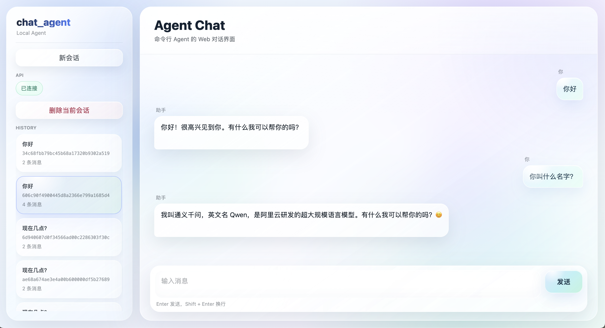

# chat_agent

一个本地中文智能 Agent 聊天助手，面向 Agent 工程化学习与实践。项目包含 FastAPI 后端、SSE 流式输出、SQLite 会话持久化、结构化工具系统、LLM 工具决策、统一异常处理、请求追踪，以及玻璃拟态 Web 前端。


## 界面预览





## 目录

- [项目特点](#项目特点)
- [技术栈](#技术栈)
- [快速开始](#快速开始)
- [配置说明](#配置说明)
- [运行方式](#运行方式)
- [Docker 部署](#docker-部署)
- [API 示例](#api-示例)
- [知识库用法](#知识库用法)
- [测试](#测试)
- [项目结构](#项目结构)
- [开发路线](#开发路线)
- [贡献](#贡献)
- [许可证](#许可证)

## 项目特点

- **Agent 编排**：按“规则工具路由 -> LLM 工具决策 -> 知识库兜底 -> 主模型回复”的顺序处理用户输入。
- **结构化工具系统**：使用 `ToolSpec` 描述工具名称、参数结构、规则匹配、执行函数和副作用属性。
- **LLM 工具决策**：主回复模型和工具决策模型分离，降低成本并提升工具调用可控性。
- **SSE 流式输出**：后端通过 `text/event-stream` 推送 token/chunk，前端实时渲染回复。
- **会话持久化**：SQLite 保存 session 和 messages，支持历史会话列表、切换、删除和刷新恢复。
- **统一异常响应**：JSON API 和 SSE 错误都带有稳定结构与 `request_id`，便于排查问题。
- **玻璃拟态前端**：Vite + Vanilla JavaScript 实现聊天界面、Markdown 渲染、Toast 提示和思考动画。
- **Docker 本地部署**：提供后端镜像、前端 Nginx 镜像和 Docker Compose 编排。
- **测试覆盖**：覆盖 Agent、工具系统、数据层、API、SSE、异常处理和 middleware。

## 技术栈

| 层级 | 技术 |
| --- | --- |
| 后端 | Python, FastAPI, SQLite |
| 模型调用 | OpenAI-compatible Chat Completions API |
| 前端 | Vite, Vanilla JavaScript |
| 前端辅助 | marked, DOMPurify |
| 测试 | pytest |
| 部署 | Docker, Docker Compose, Nginx |

## 快速开始

### 获取项目

```bash
git clone https://github.com/Llmzt/chat_agent.git
cd chat_agent
### 环境要求

- Python 3.12 或更高版本
- Node.js 20 或更高版本
- npm
- Docker 和 Docker Compose，可选
- 一个兼容 OpenAI Chat Completions 格式的模型服务

### 安装依赖

```bash
python -m venv venv
venv/bin/pip install -r requirements.txt
```

```bash
cd frontend
npm install
```

### 创建配置

```bash
cp .env.example .env
```

至少需要配置：

```bash
API_KEY="your api key"
```


## 配置说明

`.env` 示例：

```bash
BASE_URL="https://dashscope.aliyuncs.com/compatible-mode/v1"
API_KEY="your api key"
MODEL="qvq-max-2025-03-25"
PLANNER_MODEL="qwen-turbo"
REQUEST_TIMEOUT="30"
MAX_RETRIES="2"
LOG_LEVEL="INFO"
LOG_FILE="./logs/agent.log"
```

| 变量 | 说明 |
| --- | --- |
| `BASE_URL` | OpenAI-compatible API 地址 |
| `API_KEY` | 模型服务密钥 |
| `MODEL` | 主回复模型 |
| `PLANNER_MODEL` | 工具决策模型 |
| `REQUEST_TIMEOUT` | 单次模型请求超时时间 |
| `MAX_RETRIES` | 模型请求失败后的重试次数 |
| `LOG_LEVEL` | 日志级别 |
| `LOG_FILE` | 日志文件路径 |

## 运行方式

### 命令行

```bash
venv/bin/python cli.py
```

退出命令：

```text
exit
quit
q
```

### 后端 API

```bash
venv/bin/uvicorn service.api.api:app --host 127.0.0.1 --port 8000
```

健康检查：

```bash
curl http://127.0.0.1:8000/health
```

### 前端

先启动后端，再启动前端：

```bash
cd frontend
npm run dev
```

浏览器打开：

```text
http://127.0.0.1:5173
```

## Docker 部署

构建并启动完整服务：

```bash
docker compose up -d --build
```

访问地址：

```text
前端：http://127.0.0.1:5173
后端：http://127.0.0.1:8000
```

检查后端：

```bash
curl http://127.0.0.1:8000/health
```

停止服务：

```bash
docker compose down
```

Docker Compose 会挂载本地运行数据：

```text
./database -> /app/database
./logs     -> /app/logs
```

远程部署时需要注意：

- 不要提交真实 `.env` 和模型密钥。
- 当前前端默认请求 `http://127.0.0.1:8000`，部署到服务器或域名时需要改成可配置 API 地址。
- 当前 CORS 白名单面向本地开发，部署到域名时需要同步配置后端允许来源。

## API 示例

### 普通聊天

```bash
curl -X POST http://127.0.0.1:8000/chat \
  -H "Content-Type: application/json" \
  -d '{"message":"你好"}'
```

### SSE 流式聊天

```bash
curl -N -X POST http://127.0.0.1:8000/chat/stream \
  -H "Content-Type: application/json" \
  -H "Accept: text/event-stream" \
  -d '{"message":"讲一个短故事"}'
```

### 会话接口

继续指定会话：

```bash
curl -X POST http://127.0.0.1:8000/chat \
  -H "Content-Type: application/json" \
  -d '{"message":"继续","session_id":"your_session_id"}'
```

读取会话历史：

```bash
curl http://127.0.0.1:8000/sessions/{session_id}
```

列出最近会话：

```bash
curl http://127.0.0.1:8000/sessions
```

删除会话：

```bash
curl -X DELETE http://127.0.0.1:8000/sessions/{session_id}
```

### 错误响应

JSON API 错误结构：

```json
{
  "ok": false,
  "data": null,
  "error": {
    "code": "LLM_ERROR",
    "message": "模型调用失败，请稍后重试。",
    "request_id": "..."
  }
}
```

SSE 错误事件：

```text
event: error
data: {"code":"LLM_ERROR","message":"模型调用失败，请稍后重试。","request_id":"..."}
```

## 知识库用法

查询知识库：

```text
查询知识库 Python
搜索 FastAPI
```

写入知识库：

```text
添加知识：标题 | 内容 | 关键词
```

示例：

```text
添加知识：FastAPI | FastAPI 是一个 Python Web API 框架。 | Python,API
```

默认存储位置：

```text
database/knowledge.db
database/sessions.db
```

## 测试

安装测试依赖：

```bash
venv/bin/pip install -r requirements-dev.txt
```

运行全部测试：

```bash
venv/bin/python -m pytest -q
```

当前测试覆盖：

- 环境变量解析
- Agent 主流程
- ToolSpec 路由
- LLM Planner 解析和缓存
- SQLite 数据存储
- 会话和历史消息
- API 与 SSE 接口
- 错误响应
- 请求中间件

测试使用临时数据库，不会修改本地运行数据。

## 项目结构

```text
.
├── agent.py                  # Agent 编排主流程
├── cli.py                    # 命令行入口
├── service/
│   ├── llm.py                # LLM 客户端封装
│   ├── api/
│   │   ├── api.py            # FastAPI 应用和路由
│   │   └── error_response.py # API 错误响应结构
│   ├── core/
│   │   ├── config.py         # 运行时配置
│   │   ├── env.py            # .env 与项目根目录路径
│   │   ├── errors.py         # 统一异常类型
│   │   ├── logger.py         # 日志初始化
│   │   ├── middleware.py     # request_id 和耗时日志
│   │   └── request_context.py
│   ├── stores/
│   │   ├── knowledge_store.py
│   │   ├── session_store.py
│   │   └── sqlite_store.py
│   └── tools/
│       ├── tool_adapters.py
│       ├── tool_planner.py
│       └── tool_router.py
├── skill/
│   ├── knowledge.py
│   ├── knowledge_write.py
│   └── time.py
├── frontend/
├── tests/
├── Dockerfile.backend
├── docker-compose.yml
├── requirements.txt
├── requirements-dev.txt
└── pytest.ini
```

运行时生成的本地目录：

```text
database/
logs/
```

不要提交：

```text
.env
venv/
logs/
database/*.db
frontend/node_modules/
frontend/dist/
```

## 开发路线

- 可配置的前端 API 地址
- 可配置的后端 CORS 白名单
- 数据库迁移机制
- 更规范的工具注册与扩展机制
- RAG / vector search
- Prompt 模板管理
- 用户系统与权限
- 生产环境部署文档

## 贡献

这是一个学习和工程化实践项目，欢迎通过 Issue 或 Pull Request 讨论改进方向。提交前建议先运行：

```bash
venv/bin/python -m pytest -q
cd frontend
npm run build
```

## 许可证

MIT
